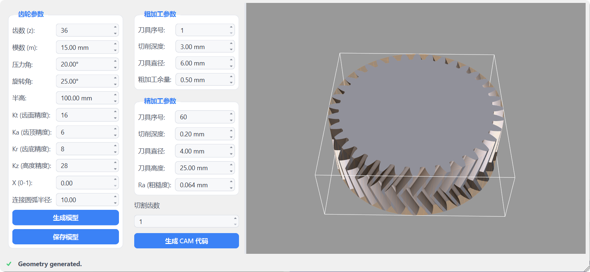

# Herringbone Gear CAD/CAM

Parametric herringbone (double-helical) gear generator with CAM toolpath output and a Qt/VTK GUI for 3D preview.



## Project Structure

```
HerringboneGear/
├── CMakeLists.txt              # Top-level build (C++17)
├── CMakePresets.json           # debug / release / release-install presets (vcpkg)
├── README.md
│
├── shared/                     # Static library: Gear::Params
│   ├── CMakeLists.txt
│   ├── includes/
│   │   ├── gear_params.h       # GearParams struct (z, m, alpha, beta, F, Kt, Ka, Kr, Kz, x, Rg)
│   │   ├── gear_derived.h      # GearDerived — derived radii, involute, hasRootRelief()
│   │   ├── gear_geometry.h     # Involute profile computation + gear::Validate()
│   │   └── point.h             # 2-D point (Cartesian / polar), shared by CAD & CAM
│   └── src/
│       ├── gear_params.cpp
│       ├── gear_geometry.cpp
│       └── point.cpp
│
├── cad/                        # Static library: Gear::CAD_Core + HerringboneGearCAD executable
│   ├── CMakeLists.txt
│   ├── main.cpp
│   ├── includes/
│   │   ├── herringbone_gear.h  # buildGearMesh(), createHerringboneGear()
│   │   ├── stock.h             # buildStockMesh(), createStock()
│   │   └── sweep.h             # sweepHalf() — helical extrusion
│   └── src/
│       ├── herringbone_gear.cpp
│       ├── stock.cpp
│       └── sweep.cpp
│
├── cam/                        # Static library: Gear::CAM_Core + HerringboneGearCAM executable
│   ├── CMakeLists.txt
│   ├── main.cpp
│   ├── includes/
│   │   ├── nc_converter.h      # HEIDENHAIN NC format writer
│   │   ├── toolpath_pass.h     # ToolpathPass — common base for machining passes
│   │   ├── roughing.h          # RoughingCut + RoughParams — layer-by-layer roughing
│   │   ├── finishing.h         # FinishingCut + FinishParams — profile-following finish
│   │   └── cam_generate.h      # generateRoughing(), generateFinishing()
│   └── src/
│       ├── nc_converter.cpp
│       ├── toolpath_pass.cpp
│       ├── roughing.cpp
│       ├── finishing.cpp
│       └── cam_generate.cpp
│
└── ui/                         # Qt GUI: GearUI executable (Qt6 on Windows, Qt5 on Linux)
    ├── CMakeLists.txt
    ├── includes/
    │   └── mainwindow.h
    ├── resources/                  # Qt resource bundle (AUTORCC)
    │   ├── resources.qrc
    │   ├── styles/
    │   │   └── app.qss             # stylesheet template; theme.cpp fills color tokens
    │   └── icons/                  # spinbox arrows (light/dark) + status glyphs
    └── src/
        ├── main.cpp
        ├── mainwindow.cpp          # setupUi(), status bar, parameter readout
        ├── setup_panels.cpp        # geometry / roughing / finishing panel builders
        ├── theme.cpp               # light/dark stylesheet from the system palette
        ├── geometry_handlers.cpp   # "生成模型" — CAD preview with smoothing
        └── cam_handlers.cpp        # "生成 CAM 代码" — NC file output
```

`webui/` 提供独立的浏览器版本：原生 Web UI + WebGL 预览，并将共享的
C++ 几何/CAM 算法编译为 WebAssembly。构建和运行方式见
[`webui/README.md`](webui/README.md)。桌面版与 Web 版可独立构建。

## Dependencies

| Library | Version | Purpose |
|---------|---------|---------|
| CMake | ≥ 3.12 (presets need 3.25) | Build system |
| VTK | 9.x | 3D mesh generation, rendering |
| Qt | Qt6 (Windows) / Qt5 5.15+ (Linux) | GUI framework |
| nlohmann_json | any | JSON parameter file parsing |

### Ubuntu / Debian install

```bash
sudo apt install cmake libvtk9-dev libvtk9-qt-dev qtbase5-dev libqt5opengl5-dev nlohmann-json3-dev
```

### Windows install (vcpkg)

```powershell
vcpkg install qtbase vtk[qt] nlohmann-json
```

## Build

### Linux

```bash
cmake -B build -S .
cmake --build build -j$(nproc)
```

### Windows (presets, run from a VS developer prompt)

```powershell
cmake --preset release          # configure (uses ~/vcpkg toolchain)
cmake --build out/build/release
```

### Outputs

| Binary | Description |
|--------|-------------|
| `<build>/ui/GearUI` | GUI application |
| `<build>/cad/HerringboneGearCAD` | CLI — writes `herringbone_gear.stl` + `gear_stock.stl` |
| `<build>/cam/HerringboneGearCAM` | CLI — writes `rough.nc` + `finish.nc` |

## Install / Package (Windows)

The `release-install` preset installs a self-contained GUI package to `dist/`
(exe + required Qt/VTK/ICU DLLs + `platforms/qwindows.dll`, no debug symbols —
resolved via CMake `RUNTIME_DEPENDENCIES`, no windeployqt needed):

```powershell
cmake --preset release-install
cmake --build out/build/release-install
cmake --install out/build/release-install   # → dist/GearUI.exe
```

## Runtime

### CLI

Both CLI executables read optional `gear.json` in the working directory to override defaults.
Parameters are validated on startup (ranges and geometric consistency); invalid
input is rejected with an error message and exit code 1.

```json
{
  "z": 24,
  "m": 10,
  "beta": 20,
  "F": 80
}
```

```bash
cd build
./cad/HerringboneGearCAD    # → herringbone_gear.stl, gear_stock.stl
./cam/HerringboneGearCAM    # → rough.nc, finish.nc
```

### GUI

```bash
./build/ui/GearUI
```

- **Left panel** — edit gear parameters (teeth, module, helix angle, …) and CAM parameters (cut depth, cutter size, stock allowance, …)
- **生成模型** — validates parameters, builds the herringbone gear + stock cylinder and displays them in the 3D viewport
- **保存模型** — exports the gear and stock as STL files
- **生成 CAM 代码** — writes HEIDENHAIN-format roughing and finishing NC files (save dialogs)
- **3D viewport** — mouse rotate / pan / zoom (trackball interaction)
- **Status bar** — bottom-of-window readout with a busy / done / error icon; tracks the active operation
- **Theme** — follows the system light/dark palette automatically

### Gear Parameters

| Parameter | Default | Description |
|-----------|---------|-------------|
| `z` | 36 | Number of teeth |
| `m` | 15 mm | Module (tooth size) |
| `alpha` | 20° | Pressure angle |
| `beta` | 25° | Helix angle per half |
| `F` | 100 mm | Half face width (total width = 2F) |
| `Kt` | 16 | Sample points per involute flank |
| `Ka` | 6 | Sample points per tip arc |
| `Kr` | 8 | Sample points per root fillet |
| `Kz` | 28 | Axial slices per half |
| `x` | 0 | Profile shift coefficient (0–1) |
| `Rg` | 10 mm | Root connecting-arc radius (used when the root circle lies inside the base circle, i.e. small tooth counts) |
